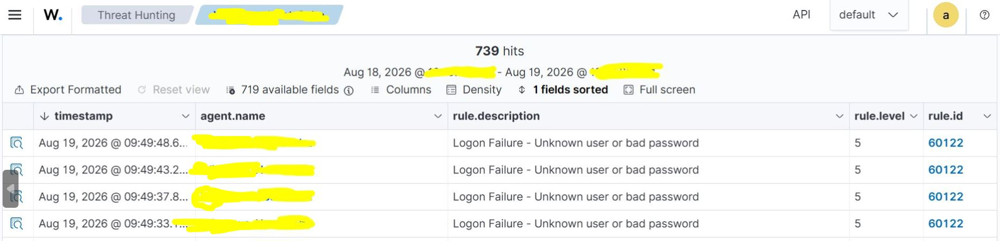
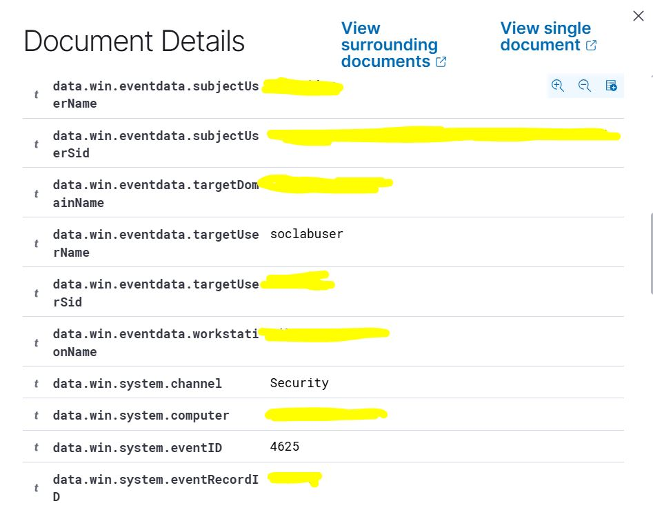

# LAB 01 - Wazuh Windows Authentication

## Objective

The objective of this lab is to detect and investigate failed Windows authentication attempts using Wazuh.

This lab demonstrates the basic SOC workflow:


Windows activity
→ Windows Security Event
→ Wazuh Agent
→ Wazuh Server
→ Wazuh Dashboard
→ SOC investigation

## Lab Architecture

Due to local hardware limitations, the lab was adapted to use the physical Windows host as the monitored endpoint and a virtual machine as the Wazuh server.

```text
Windows Endpoint
Wazuh Agent installed
        |
        | Events and alerts
        v
Wazuh Server VM
Ubuntu Server + Wazuh Manager + Wazuh Indexer + Wazuh Dashboard
```

Sanitized lab references:

```text
Windows endpoint: WINDOWS-ENDPOINT
Wazuh server: WAZUH-SERVER
Wazuh server IP: <WAZUH_SERVER_IP>
Test user: soclabuser
Analyst user: analyst-user
```

## Tools Used

* Windows 10
* Wazuh Agent
* Wazuh Server
* Wazuh Dashboard
* Ubuntu Server
* VirtualBox
* Windows Event Viewer
* PowerShell

## Scenario

A local test user was created on the Windows endpoint. Multiple failed authentication attempts were generated using an incorrect password.

The goal was to verify that:

1. Windows generated failed logon events.
2. Wazuh Agent collected the events.
3. Wazuh Server received and processed the events.
4. Wazuh Dashboard displayed the alerts.
5. The event could be investigated using SOC analysis fields.

## Configuration Summary

The Wazuh Agent was installed on the Windows endpoint and configured to communicate with the Wazuh Server.

The agent appeared as active in the Wazuh Dashboard.


Agent name: WINDOWS-ENDPOINT
Agent status: Active
Manager: WAZUH-SERVER


## Activity Generated

A local test user was created:

```powershell
net user soclabuser Lab12345! /add
```

Failed authentication attempts were generated using:

```powershell
runas /user:soclabuser cmd
```

An incorrect password was entered several times to generate failed logon events.

## Detection in Wazuh

Wazuh detected the failed logon attempts and generated alerts with the following rule:

```text
rule.id: 60122
rule.description: Logon Failure - Unknown user or bad password
rule.level: 5
rule.groups: windows, windows_security, authentication_failed
```

The original Windows event was:

```text
data.win.system.eventID: 4625
```

Windows Event ID `4625` represents a failed logon attempt.

## Event Analysis

Key fields observed in the event:

```text
data.win.system.eventID: 4625
data.win.system.channel: Security
data.win.system.providerName: Microsoft-Windows-Security-Auditing
data.win.eventdata.targetUserName: soclabuser
data.win.eventdata.logonType: 2
data.win.eventdata.ipAddress: ::1
data.win.eventdata.status: 0xc000006d
data.win.eventdata.subStatus: 0xc000006a
rule.id: 60122
rule.description: Logon Failure - Unknown user or bad password
```

Field interpretation:

| Field                        | Meaning                            |
| ---------------------------- | ---------------------------------- |
| `eventID: 4625`              | Failed Windows logon event         |
| `targetUserName: soclabuser` | Account that failed authentication |
| `logonType: 2`               | Interactive logon attempt          |
| `ipAddress: ::1`             | Localhost IPv6 address             |
| `status: 0xc000006d`         | Authentication failure             |
| `subStatus: 0xc000006a`      | Incorrect password                 |
| `rule.id: 60122`             | Wazuh rule for failed logon        |

## SOC Investigation Notes

Four failed logon events were observed during the lab.

The events had the same rule description and were related to the same test user. The timestamps showed repeated failed attempts in a short period of time.

In a real SOC environment, these events should be reviewed by grouping and comparing key fields such as:

```text
targetUserName
source IP address
workstationName
logonType
status
subStatus
timestamp
agent.name
```

For this lab, the activity was expected and controlled.

## MITRE ATT&CK Consideration

Wazuh mapped the rule to:

```text
MITRE ATT&CK ID: T1531
Tactic: Impact
Technique: Account Access Removal
```

However, in this specific lab scenario, the observed evidence only confirms failed local authentication attempts. There was no evidence of account access removal or real impact.

This highlights an important SOC lesson: MITRE mappings from tools should be reviewed critically and validated against the actual evidence.

## Evidence and Screenshots
### Wazuh failed logon alerts

The following screenshot shows multiple failed Windows logon alerts detected by Wazuh.



### Windows Event ID 4625 details

The following screenshot shows the detailed event fields collected by Wazuh, including the original Windows Security Event ID `4625` and the target test user.



## Conclusion

This lab successfully demonstrated the detection and investigation of failed Windows authentication attempts using Wazuh.

The complete detection flow was validated:

```text
Failed login attempt
→ Windows Security Event ID 4625
→ Wazuh Agent
→ Wazuh Server
→ Wazuh Rule 60122
→ Dashboard alert
→ SOC investigation
```

The event was confirmed as expected lab activity because it originated from a controlled test using a local test user.

## Evidence and Screenshots

Recommended screenshots to include after sanitization:

* Wazuh agent active in the dashboard
* Wazuh event list showing failed logon alerts
* Event details showing `eventID: 4625`
* Event details showing `targetUserName: soclabuser`
* Event details showing `rule.id: 60122`

Before uploading screenshots, remove or blur:

```text
real hostname
real username
real SIDs
personal paths
private IPs if not needed
tokens
passwords
browser profile information
```

## Lessons Learned

* Windows failed logon attempts generate Security Event ID `4625`.
* Wazuh Agent can collect Windows Security events and forward them to Wazuh Server.
* Wazuh uses its own rule IDs to classify events.
* Windows Event ID and Wazuh Rule ID are different concepts.
* A SOC analyst should review event fields before making conclusions.
* Tool-generated MITRE mappings should be validated against the actual evidence.

## Possible Improvements

* Repeat the lab using a dedicated Windows virtual machine.
* Add Sysmon telemetry in a future lab.
* Create custom Wazuh rules for repeated failed logon attempts.
* Compare failed local logons with failed network logons.
* Add Active Directory authentication scenarios in future labs.
* Automate alert enrichment using Python or SOAR in later labs.

