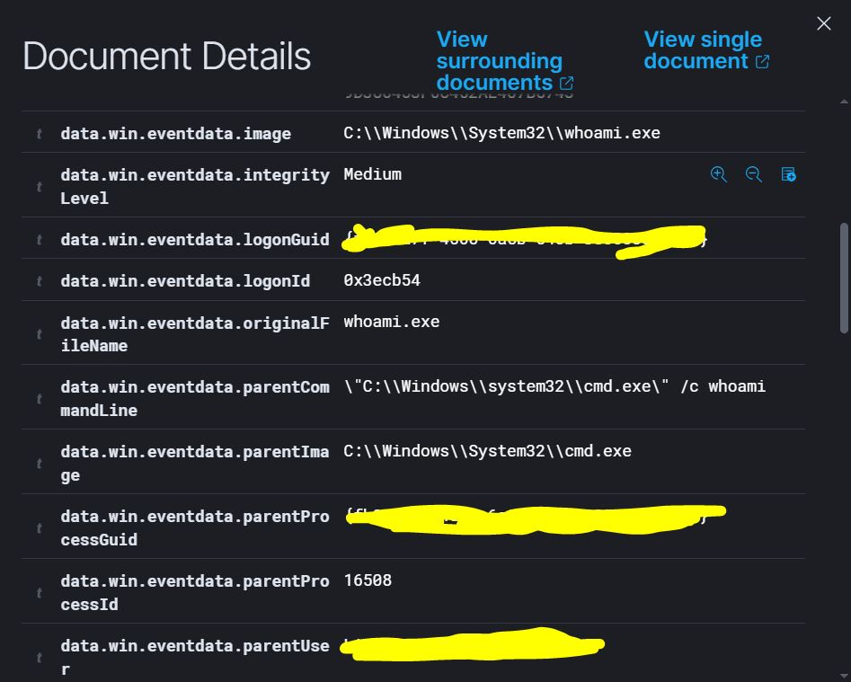
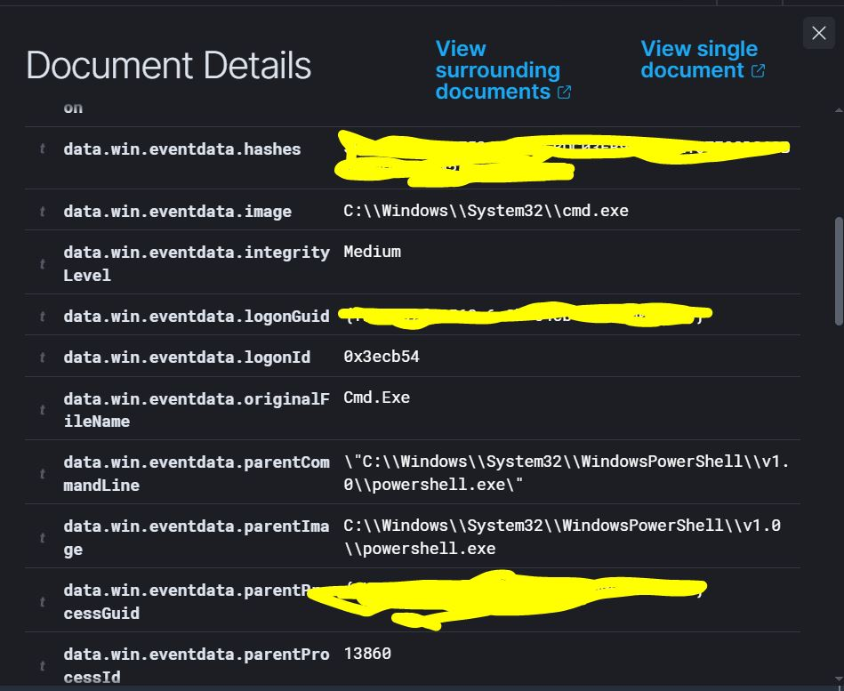
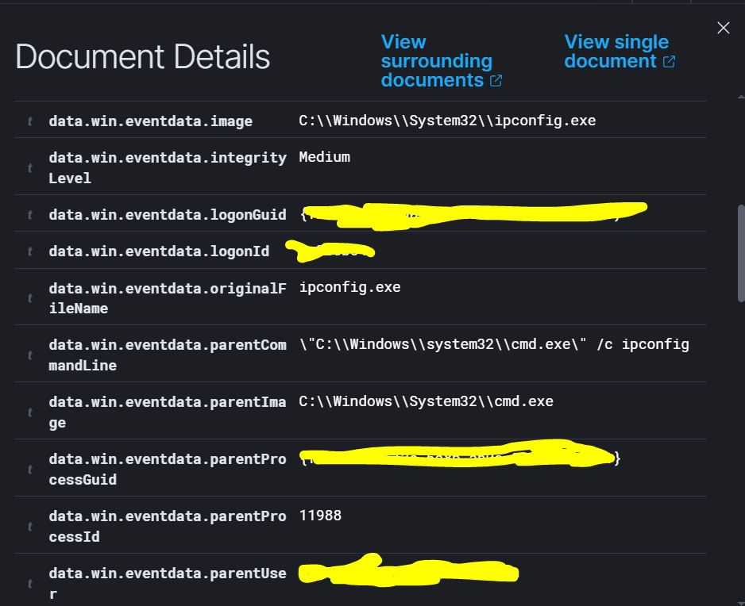
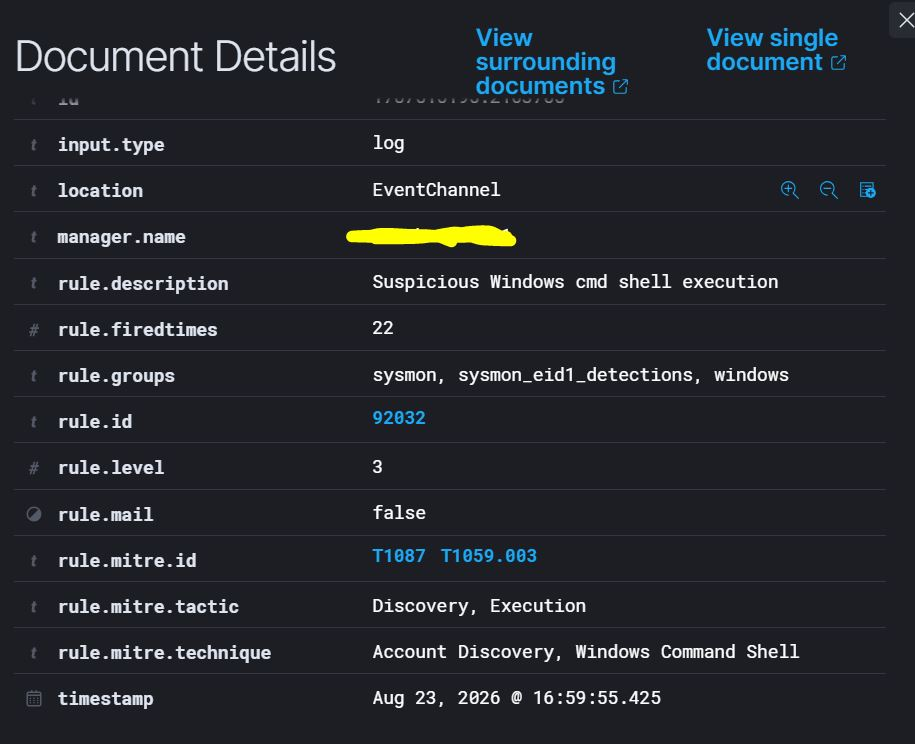

# LAB 03 - Suspicious Process Investigation

## Objective

Investigate benign but potentially suspicious Windows process activity using **Sysmon** and **Wazuh**.

The focus of this lab is to analyze process context, parent-child relationships and Wazuh detections.

---

## Lab Architecture

### Windows Endpoint

* Windows 10
* Sysmon
* Wazuh Agent
* PowerShell
* cmd.exe

### Wazuh Server

* Wazuh Manager
* Wazuh Indexer
* Wazuh Dashboard
* Ubuntu Server VM

### Sanitized References

* `WINDOWS-ENDPOINT`
* `WAZUH-SERVER`
* `<WAZUH_SERVER_IP>`
* `analyst-user`

---

## Activity Generated

The following commands were executed from PowerShell:

* `cmd.exe /c whoami`
* `cmd.exe /c hostname`
* `cmd.exe /c ipconfig`

Observed process chains:

* `powershell.exe → cmd.exe → whoami.exe`
* `powershell.exe → cmd.exe → hostname.exe`
* `powershell.exe → cmd.exe → ipconfig.exe`

All activity was generated manually in a controlled environment.

---

## Detection in Wazuh

Sysmon generated **Event ID 1 - Process Create** events for the executed processes.

### Rule 92004

* **Description:** `Powershell process spawned Windows command shell instance`
* **Level:** `4`
* **MITRE:** `T1059.003 - Windows Command Shell`
* **Tactic:** `Execution`

Observed relationship: `powershell.exe → cmd.exe`

### Rule 92032

* **Description:** `Suspicious Windows cmd shell execution`
* **Level:** `3`
* **MITRE:** `T1087`, `T1059.003`
* **Tactics:** `Discovery`, `Execution`

Observed relationships:

* `cmd.exe → whoami.exe`
* `cmd.exe → hostname.exe`
* `cmd.exe → ipconfig.exe`

No custom Wazuh rules were created.

---

## Event Analysis

Relevant fields analyzed:

* `image`
* `commandLine`
* `parentImage`
* `parentCommandLine`
* `processId`
* `parentProcessId`
* `user`
* `integrityLevel`
* `rule.id`
* `rule.mitre`

The process chains were validated by comparing `ProcessId` and `ParentProcessId`.

---

## SOC Investigation Notes

The executed commands are legitimate Windows utilities.

* `whoami` identifies the current user.
* `hostname` identifies the system.
* `ipconfig` displays network configuration.

These commands are not malicious by themselves, but they may become relevant when observed together or after suspicious activity.

The key lesson is that an analyst should evaluate:

* Who executed the command.
* Which process launched it.
* What command line was used.
* What happened before and after.
* Whether the sequence is normal for the endpoint.

The activity in this lab was confirmed as expected and benign.

---

## MITRE ATT&CK

Wazuh mapped the activity mainly to:

* `T1059.003 - Windows Command Shell`
* `T1087 - Account Discovery`

`T1087` is relevant to `whoami`, but the same Wazuh rule also appeared for `hostname` and `ipconfig`.

This shows that MITRE mappings from detection rules must always be validated against the actual event behavior.

---

## Evidence and Screenshots

### whoami.exe Parent Process

### cmd.exe Parent Process

### ipconfig.exe Parent Process

### Wazuh Rule 92032

---

## Security and Sanitization Notes

Before publishing, the following information was removed or masked:

* Real hostname
* Username
* Agent name and IP
* Manager name
* GUIDs
* Event Record IDs
* Personal paths
* Unnecessary hashes
* Sensitive identifiers

---

## Lessons Learned

* Sysmon Event ID 1 records process creation.
* One command can generate multiple related process events.
* Parent-child relationships help reconstruct execution chains.
* Legitimate tools can still be relevant during an investigation.
* Wazuh alerts indicate activity worth reviewing, not proof of compromise.
* MITRE mappings must be validated against the actual evidence.
* Context is more important than the process name alone.

---

## Conclusion

LAB 03 demonstrated how to investigate Windows discovery activity using Sysmon and Wazuh.

The main chains analyzed were:

* `powershell.exe → cmd.exe → whoami.exe`
* `powershell.exe → cmd.exe → hostname.exe`
* `powershell.exe → cmd.exe → ipconfig.exe`

The main takeaway is that **process behavior must be analyzed in context, not in isolation**.
