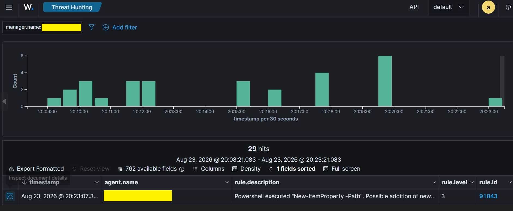
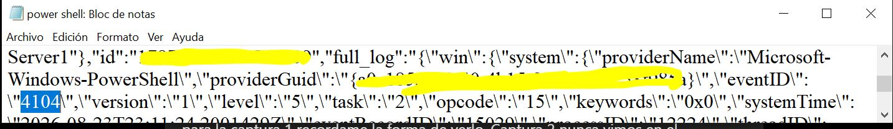
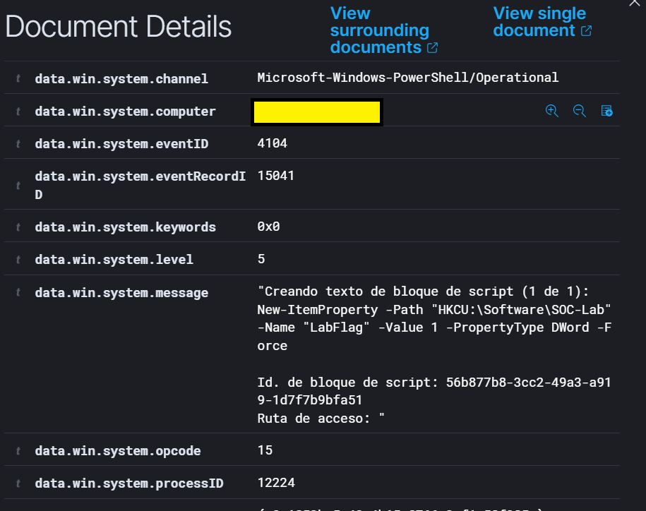
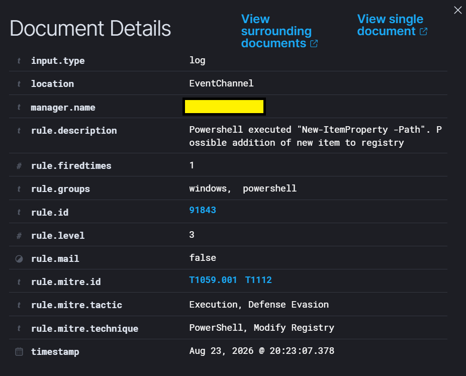

# LAB 05 - PowerShell Defensive Monitoring

## Objective

Monitor PowerShell activity using **Windows Script Block Logging** and **Wazuh**.

The goal was to understand the difference between PowerShell telemetry collection and an actual SIEM alert.

---

## Lab Architecture

### Windows Endpoint

* Windows 10
* PowerShell
* Wazuh Agent
* PowerShell Operational Event Log

### Wazuh Server

* Wazuh Manager
* Wazuh Indexer
* Wazuh Dashboard
* Ubuntu Server VM

---

## Configuration

PowerShell Script Block Logging was enabled on Windows.

The Wazuh Agent was also configured to collect:

`Microsoft-Windows-PowerShell/Operational`

This allowed PowerShell Script Block events to be forwarded to Wazuh.

---

## Activity Generated

Two main PowerShell activities were tested.

### Local Account Discovery

`Get-LocalUser`

Windows generated:

* **Event ID:** `4104`
* **Channel:** `Microsoft-Windows-PowerShell/Operational`
* **Script Block:** `Get-LocalUser`

The event reached the Wazuh Manager but did not generate a visible alert in Threat Hunting.

### Registry Modification

A controlled registry entry was created using:

`New-ItemProperty -Path "HKCU:\Software\SOC-Lab" -Name "LabFlag" -Value 1 -PropertyType DWord -Force`

This activity generated Event ID `4104` and matched an existing Wazuh detection rule.

---

## Detection in Wazuh

### PowerShell Event

* **Event ID:** `4104`
* **Provider:** `Microsoft-Windows-PowerShell`
* **Channel:** `Microsoft-Windows-PowerShell/Operational`

### Wazuh Rule

* **Rule ID:** `91843`
* **Rule level:** `3`
* **Description:** `Powershell executed "New-ItemProperty -Path". Possible addition of new item to registry`

### MITRE ATT&CK

* `T1059.001 - PowerShell`
* `T1112 - Modify Registry`

Tactics:

* `Execution`
* `Defense Evasion`

---

## Troubleshooting

Initially, `Get-LocalUser` generated Event ID `4104` in Windows but no alert appeared in Wazuh Threat Hunting.

The investigation confirmed:

* Windows was generating Event ID `4104`.
* The Wazuh Agent was monitoring the PowerShell Operational channel.
* The event was reaching the Wazuh Manager.
* `archives.json` contained `scriptBlockText: Get-LocalUser`.
* The event was collected successfully but did not match a rule that generated the expected alert.

A custom rule was tested during troubleshooting but was not required for the final detection.

The successful test used the existing Wazuh Rule `91843`.

This demonstrated that **event collection and alert generation are separate stages**.

---

## SOC Investigation Notes

PowerShell is widely used for legitimate administration but is also frequently abused during attacks.

Event ID `4104` is useful because it provides visibility into the actual PowerShell script block being executed.

An analyst should evaluate:

* Script block content
* User context
* Command purpose
* Related processes
* Registry or file changes
* Network activity
* Existing Wazuh rules
* MITRE ATT&CK mappings

A PowerShell event alone does not prove malicious activity.

---

## Evidence and Screenshots

### Wazuh Dashboard

Threat Hunting view showing the successful PowerShell detection.

### Event 4104 Troubleshooting

Evidence from `archives.json` confirming that PowerShell Event ID `4104` reached the Wazuh Manager even when no alert was generated.

### PowerShell Event ID 4104

Wazuh event showing the PowerShell `New-ItemProperty` Script Block and Event ID `4104`.

### Rule 91843 and MITRE Mapping

Wazuh detected the controlled registry modification using Rule `91843` and mapped the activity to PowerShell and registry modification techniques.

---

## Security and Sanitization Notes

Before publishing, sensitive information was removed or masked:

* Hostname
* Username
* Agent name and IP
* Manager name
* GUIDs
* Event Record IDs
* Personal paths
* Unnecessary identifiers

---

## Cleanup

After completing the lab:

* The temporary registry key `HKCU:\Software\SOC-Lab` was removed.
* Temporary `logall_json` diagnostic logging was disabled.
* The experimental custom Wazuh rule was removed.
* Script Block Logging remained enabled.
* PowerShell Operational channel collection remained enabled.

---

## Lessons Learned

* PowerShell Event ID `4104` records Script Block activity.
* Script Block Logging provides visibility into executed PowerShell code.
* Wazuh can collect PowerShell Operational events.
* Receiving an event does not guarantee that an alert will be generated.
* `archives.json` can help troubleshoot events that reach the manager but do not trigger alerts.
* Existing Wazuh rules can detect specific PowerShell behaviors.
* Rule `91843` detected controlled registry modification.
* PowerShell activity must always be analyzed in context.

---

## Conclusion

LAB 05 validated PowerShell defensive monitoring from telemetry generation to SIEM detection.

The final detection flow was:

**PowerShell → Event ID 4104 → Wazuh Agent → Wazuh Manager → Rule 91843 → MITRE ATT&CK**

The main takeaway is that **telemetry collection and alert generation are different stages of the SOC detection pipeline**.
