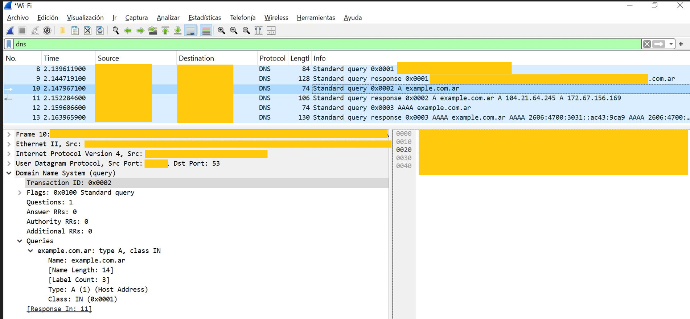
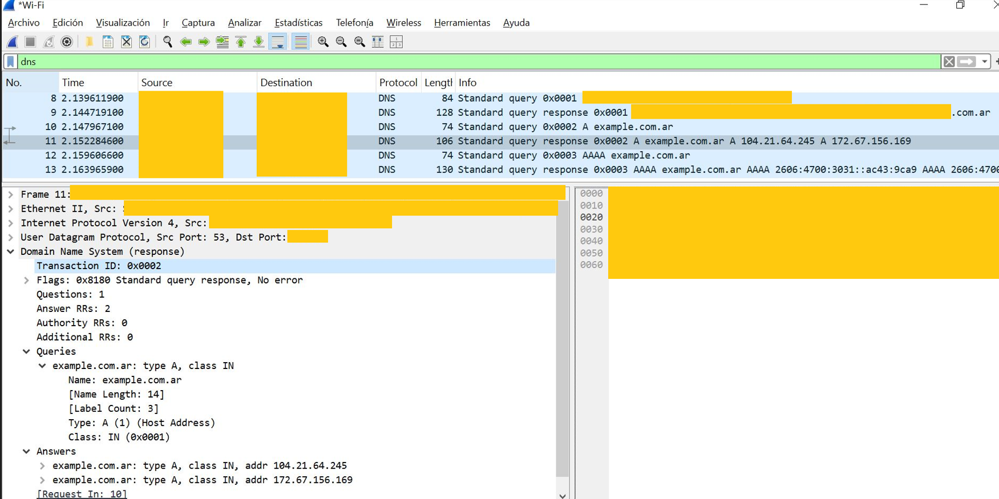
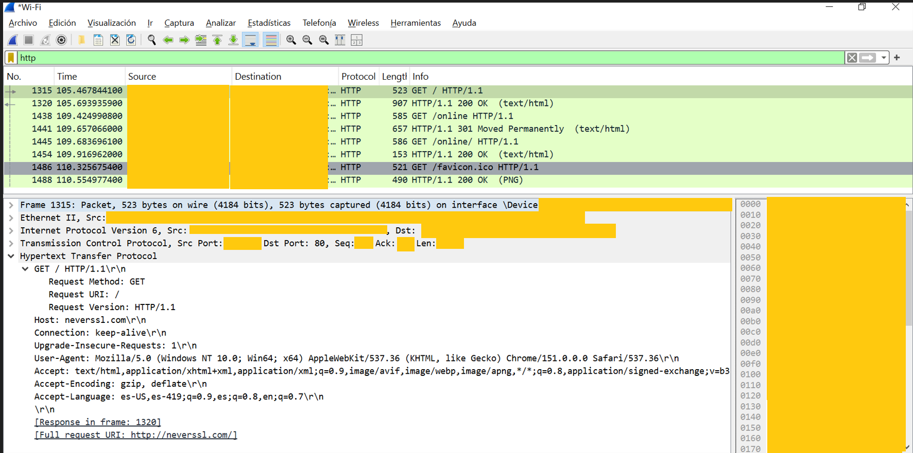
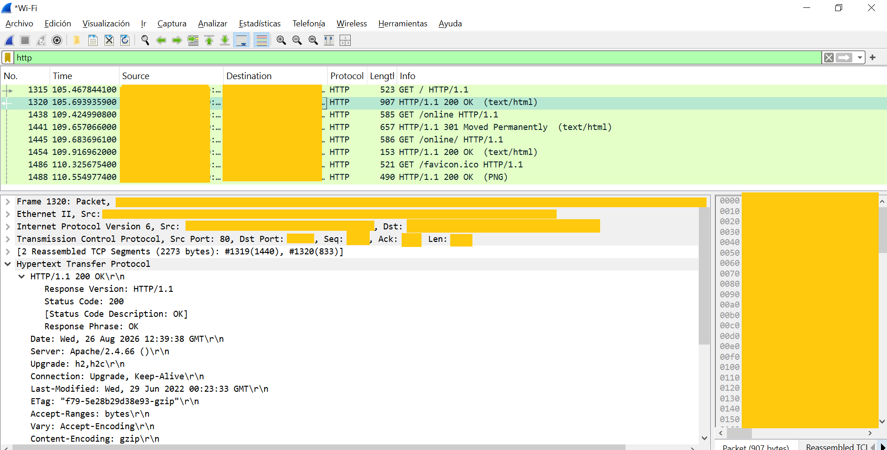
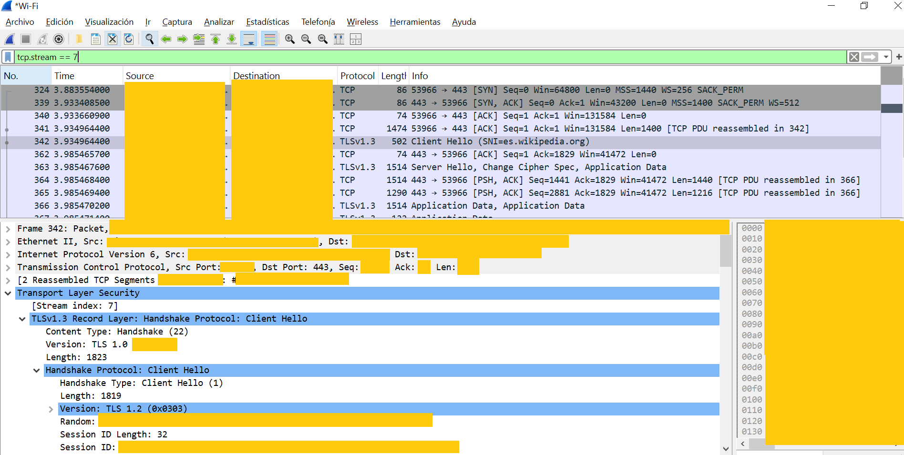

# LAB 06 - Network Analysis with Wireshark

## Objective

Analyze basic network traffic using **Wireshark**.

The lab focuses on DNS, HTTP, HTTPS/TLS and outbound TCP connections from a SOC perspective.

---

## Lab Environment

### Windows Endpoint

* Windows 10
* Wireshark
* Npcap
* Chrome
* PowerShell

### Traffic Analyzed

* DNS
* HTTP
* HTTPS
* TCP
* TLS

---

## DNS Analysis

A DNS query was generated for:

`example.com.ar`

Wireshark captured a DNS query and its corresponding response.

### Query

* Protocol: DNS
* Transport: UDP
* Destination port: `53`
* Record type: `A`
* Transaction ID used to correlate query and response

An `A` record requests an IPv4 address.

An `AAAA` record performs the equivalent lookup for IPv6.

### Response

The DNS response used the same Transaction ID as the original query.

The response contained IPv4 addresses associated with the requested domain.

This demonstrated:

`DNS Query → DNS Server → DNS Response`

---

## HTTP Analysis

HTTP traffic was generated by visiting:

`http://neverssl.com`

Wireshark displayed the request in clear text.

### HTTP Request

Observed information included:

* `GET / HTTP/1.1`
* Host
* User-Agent
* Request URI
* TCP destination port `80`

### HTTP Response

The corresponding response showed:

* `HTTP/1.1 200 OK`
* Status Code `200`
* Server information
* Content headers

Wireshark linked the request and response using their frame numbers.

This demonstrated that HTTP traffic can expose application-layer information in clear text.

---

## HTTPS / TLS Analysis

HTTPS traffic was analyzed using Wikipedia.

The connection was isolated using the TCP stream associated with:

`es.wikipedia.org`

### TCP Three-Way Handshake

The connection started with:

`SYN → SYN, ACK → ACK`

This established the TCP connection to destination port `443`.

### TLS Handshake

After TCP was established, Wireshark showed:

* `Client Hello`
* `SNI=es.wikipedia.org`
* `Server Hello`
* `Application Data`

Observed flow:

`TCP handshake → TLS handshake → encrypted HTTPS traffic`

Unlike HTTP, the actual web request and application data were not visible in clear text.

---

## HTTP vs HTTPS

### HTTP

Visible information included:

* GET request
* Host
* User-Agent
* URI
* Response status
* Headers

### HTTPS

Visible information included:

* Source and destination
* TCP port `443`
* TCP handshake
* TLS handshake
* SNI
* Encrypted Application Data

Main difference:

**HTTP exposes application data in clear text, while HTTPS protects it using TLS encryption.**

---

## SOC Investigation Notes

Network traffic analysis can help answer questions such as:

* Which host initiated the connection?
* What destination was contacted?
* Which protocol and port were used?
* Was DNS resolution performed first?
* Was the traffic encrypted?
* Which hostname appeared in TLS SNI?
* Was the connection expected for the endpoint?

A network connection alone does not prove malicious activity.

The analyst must evaluate the destination, protocol, timing and surrounding activity.

---

## Evidence and Screenshots

### DNS Query

DNS type A query for `example.com.ar`.

### DNS Response

DNS response associated with the original query.

### HTTP GET Request

HTTP request generated while accessing `neverssl.com`.

### HTTP 200 Response

HTTP response showing status code `200 OK`.

### Wikipedia TCP / TLS Handshake

TCP three-way handshake followed by the TLS negotiation for `es.wikipedia.org`.

---

## Security and Sanitization Notes

Before publishing, sensitive information was removed or masked:

* Private IP addresses
* Public IP address when associated with the local connection
* IPv6 addresses
* MAC addresses
* Interface identifiers
* Hostnames related to the local environment
* Unnecessary packet identifiers
* Raw hexadecimal data when not required

Public destination domains and addresses were preserved only when they contributed to the technical analysis.

---

## Lessons Learned

* DNS commonly uses UDP port `53`.
* DNS `A` records resolve IPv4 addresses.
* DNS `AAAA` records resolve IPv6 addresses.
* DNS Transaction IDs correlate queries and responses.
* HTTP commonly uses TCP port `80`.
* HTTP requests and headers can be inspected in clear text.
* HTTPS commonly uses TCP port `443`.
* TCP connections begin with a three-way handshake.
* TLS encrypts application traffic.
* SNI may reveal the requested hostname during TLS negotiation.
* Wireshark display filters help isolate relevant traffic.
* Network events must always be interpreted in context.

---

## Conclusion

LAB 06 demonstrated basic network investigation using Wireshark.

The analyzed flow covered:

`DNS → HTTP → TCP → TLS → HTTPS`

The main takeaway is that **network analysis provides visibility into who communicates with whom, using which protocol, and whether the application data is exposed or encrypted**.
