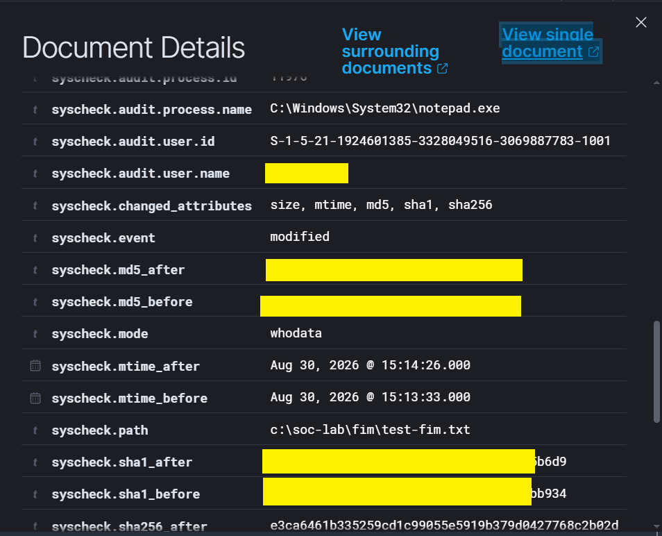
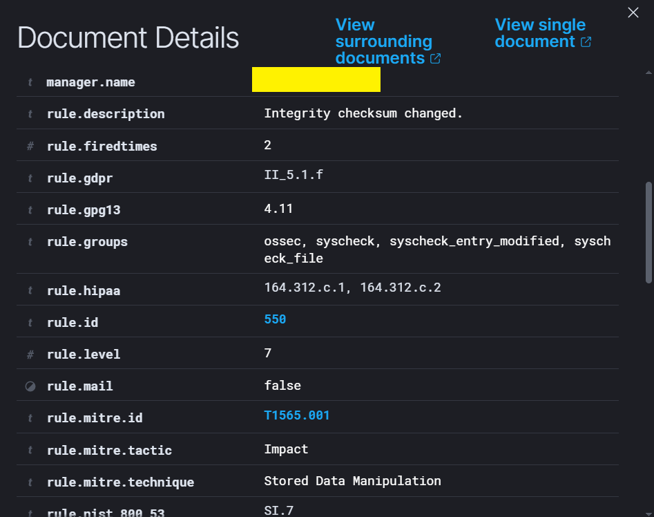
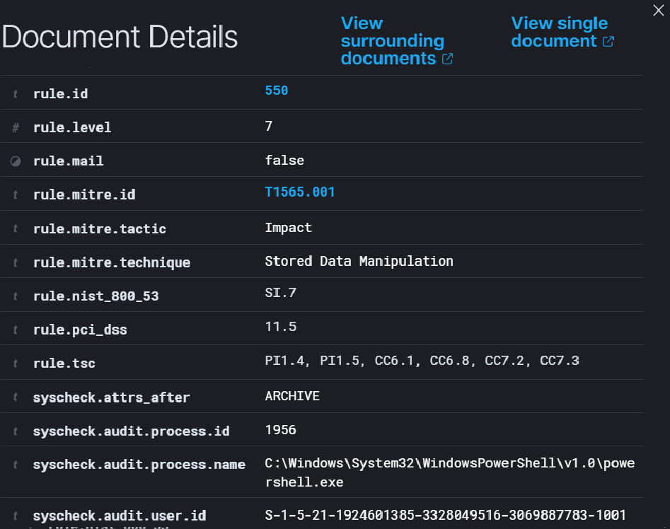
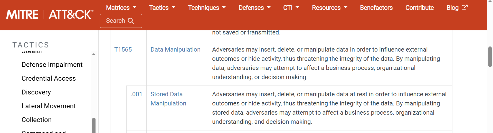

# LAB 07 - Advanced File Integrity Monitoring

## Objective

Extend the File Integrity Monitoring work from LAB 04 by using **Wazuh Who-data** to identify not only that a file changed, but also **which user and which process performed the modification**.

---

## Lab Architecture

Windows Endpoint → Wazuh Agent → Wazuh Manager → FIM / Who-data → SOC Investigation

Monitored path:

`C:\SOC-Lab\FIM`

---

## Configuration

The monitored directory was configured with Who-data enabled:

`<directories realtime="yes" whodata="yes">C:\SOC-Lab\FIM</directories>`

This allows Wazuh FIM to collect additional audit information about file changes.

---

## Activity Generated

A test file was created:

`C:\SOC-Lab\FIM\test-fim.txt`

Two controlled modifications were performed:

* Modification using Notepad
* Modification using PowerShell

The purpose was to compare how Who-data identifies the process responsible for the same type of file change.

---

## Detection with Notepad

Wazuh detected the file modification with:

* `syscheck.event: modified`
* `syscheck.mode: whodata`
* Changed attributes: size, mtime, MD5, SHA1 and SHA256
* Process: `C:\Windows\System32\notepad.exe`
* User responsible for the modification

This demonstrates that Who-data adds process and user attribution to standard FIM telemetry.

---

## Wazuh Detection

The modification triggered:

* Rule ID: `550`
* Level: `7`
* Description: `Integrity checksum changed`
* MITRE ATT&CK: `T1565.001`
* Technique: `Stored Data Manipulation`
* Tactic: `Impact`

---

## Detection with PowerShell

The same file was then modified using PowerShell.

Who-data identified:

* `syscheck.event: modified`
* `syscheck.mode: whodata`
* Process: `powershell.exe`
* User responsible for the modification
* Changes in file hashes and metadata

The Wazuh event still triggered Rule `550`, but the process attribution changed from:

`notepad.exe`

to:

`powershell.exe`

---

## Event Analysis

The main difference between standard FIM and Who-data is the additional context.

Standard FIM:

`File changed`

Who-data:

`File changed → User → Process`

This provides much more useful information during a SOC investigation.

---

## MITRE ATT&CK

Wazuh mapped the file modification to:

**T1565.001 — Stored Data Manipulation**

This sub-technique belongs to:

**T1565 — Data Manipulation**

The technique represents the modification of stored data in a way that can affect its integrity.

---

## SOC Investigation Notes

Who-data helps answer questions such as:

* Who modified the file?
* Which process performed the modification?
* Which file attributes changed?
* Did the modification occur through a normal application or a command-line process?
* Does the process match expected user activity?

A file modification alone does not indicate malicious activity.

The analyst must interpret the process, user, file path and surrounding events together.

---

## Security and Sanitization

Before publishing the evidence, sensitive information was removed or masked, including:

* Real username
* Windows SID
* Endpoint hostname
* Wazuh Manager hostname
* Private IP addresses
* File hashes where unnecessary
* Other local identifiers

---

## Lessons Learned

* Wazuh FIM can detect file integrity changes.
* `realtime="yes"` enables near real-time monitoring.
* `whodata="yes"` adds process and user attribution.
* The same file modification can be traced back to different processes.
* Notepad and PowerShell modifications can be distinguished using Who-data.
* Rule `550` identifies integrity checksum changes.
* Wazuh mapped the event to MITRE ATT&CK `T1565.001`.
* Additional context improves SOC investigation quality.

---

## Conclusion

LAB 07 demonstrated how Wazuh Who-data extends traditional File Integrity Monitoring.

Instead of only detecting that a file changed, the analyst can also identify **who changed it and which process performed the action**.

Final investigation flow:

`File Modification → FIM → Who-data → User + Process → Wazuh Rule 550 → MITRE ATT&CK`
