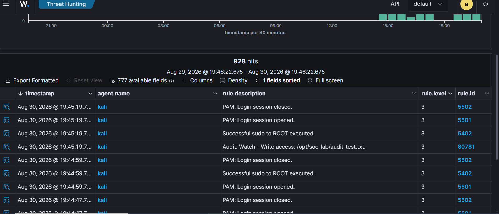
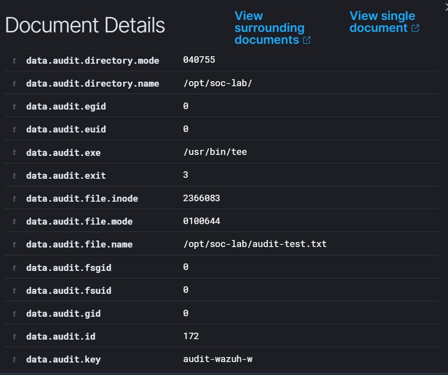
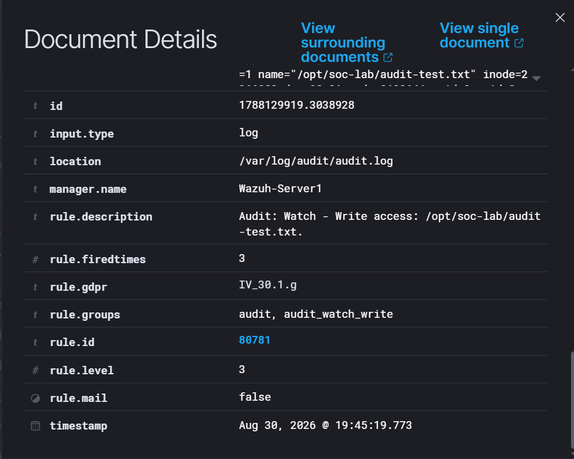

# LAB 08 - Linux auditd with Wazuh

## Objective

Monitor Linux file activity using **auditd** and send the resulting audit events to **Wazuh** for SOC investigation.

The goal of this lab is to understand how Linux audit events can provide context about:

* Which file was accessed
* Which process performed the action
* Which user initiated the activity
* Whether the operation succeeded
* Which Wazuh rule detected the event

---

## Lab Architecture

Kali Linux → auditd → Wazuh Agent → Wazuh Manager → Threat Hunting

### Linux Endpoint

* Kali Linux
* Wazuh Agent
* auditd

### Wazuh Server

* Ubuntu Server
* Wazuh Manager
* Wazuh Indexer
* Wazuh Dashboard

---

## Auditd Configuration

A controlled test file was created:

`/opt/soc-lab/audit-test.txt`

A temporary audit rule was configured to monitor write activity:

`-w /opt/soc-lab/audit-test.txt -p w -k audit-wazuh-w`

The key `audit-wazuh-w` allows Wazuh to identify the event as a write operation monitored by auditd.

---

## Wazuh Agent Configuration

The Kali Wazuh Agent was configured to collect:

`/var/log/audit/audit.log`

using the audit log format.

This created the pipeline:

`auditd → audit.log → Wazuh Agent → Wazuh Manager`

---

## Activity Generated

A controlled modification was performed using:

`tee`

The command appended data to:

`/opt/soc-lab/audit-test.txt`

auditd recorded the activity and Wazuh received the resulting event.

---

## Detection in Wazuh

The event appeared in Threat Hunting with:

* Rule ID: `80781`
* Level: `3`
* Description: `Audit: Watch - Write access`
* Agent: `kali`

---

## Event Analysis

The decoded audit event included:

* Process: `/usr/bin/tee`
* Command: `tee`
* File: `/opt/soc-lab/audit-test.txt`
* Audit key: `audit-wazuh-w`
* Working directory: `/home/kali`
* Success: `yes`
* Audit user ID: `1000`
* Effective user ID: `0`

This allows the analyst to reconstruct the activity:

`User → sudo/root → tee → audit-test.txt`

---

## Wazuh Rule

Wazuh decoded the Linux audit event using the `auditd` decoder.

The detection was generated by:

* Rule ID: `80781`
* Level: `3`
* Group: `audit`
* Group: `audit_watch_write`
* Log source: `/var/log/audit/audit.log`

---

## SOC Investigation Notes

auditd provides detailed visibility into Linux system activity.

Useful investigation fields include:

* `data.audit.exe`
* `data.audit.command`
* `data.audit.file.name`
* `data.audit.key`
* `data.audit.auid`
* `data.audit.uid`
* `data.audit.cwd`
* `data.audit.success`

The event showed that the file modification was performed through `tee` with elevated privileges.

This type of telemetry helps distinguish between normal administrative activity and potentially suspicious system changes.

---

## Troubleshooting

The first audit rule used a custom key:

`soc_lab_file`

auditd generated the events correctly, but Wazuh did not generate the expected alert.

The rule was replaced with the standard Wazuh audit write key:

`audit-wazuh-w`

After that change, Wazuh generated Rule `80781` successfully.

This reinforced an important lesson:

**Telemetry can exist locally without necessarily producing a SIEM alert until the event matches the expected detection logic.**

---

## MITRE ATT&CK

The Wazuh Rule `80781` used in this lab did not include a MITRE ATT&CK mapping.

This does not mean the event is irrelevant.

The analyst must still interpret:

* the user
* the process
* the file
* the operation
* the context

before determining whether the activity is suspicious.

---

## Security and Sanitization

The lab used a controlled Kali Linux endpoint and a dedicated test path.

The screenshots contain only laboratory information such as:

* `kali`
* `/opt/soc-lab/`
* `/usr/bin/tee`
* auditd rule identifiers

No personal credentials, tokens or sensitive production information were included.

---

## Lessons Learned

* auditd provides detailed Linux audit telemetry.
* Wazuh can collect and decode `/var/log/audit/audit.log`.
* Audit rules can monitor specific files and operations.
* Wazuh Rule `80781` detects monitored write access.
* auditd can identify the process responsible for a file operation.
* `auid` helps identify the original logged-in user.
* `uid` and `euid` show the privileges used during the operation.
* Standard Wazuh audit keys simplify rule matching.
* Linux audit telemetry adds valuable context to SOC investigations.

---

## Conclusion

LAB 08 demonstrated the integration of Linux auditd with Wazuh.

The final detection flow was:

`Linux Activity → auditd → audit.log → Wazuh Agent → Wazuh Manager → Rule 80781 → SOC Investigation`

The main takeaway is that **auditd provides detailed Linux system telemetry that Wazuh can transform into searchable security events for investigation**.
