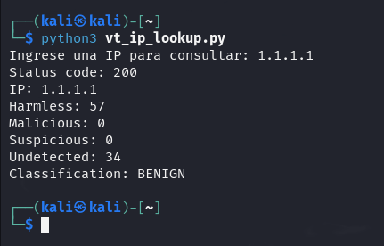
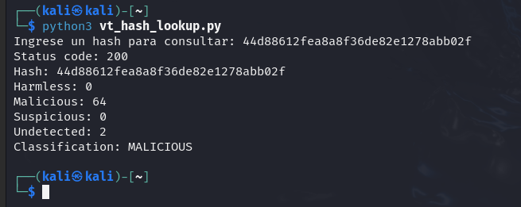
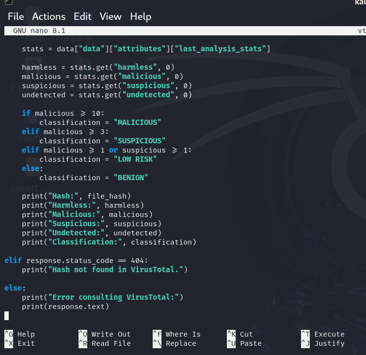

# LAB 09 - Threat Intelligence / IOC Enrichment

## Objective

Use the VirusTotal API to enrich Indicators of Compromise (IOCs) and classify their reputation from a SOC perspective.

The lab focuses on:

* IP reputation
* File hash reputation
* VirusTotal API
* Python automation
* Basic IOC classification
* Analyst interpretation

---

## Lab Architecture

Kali Linux → Python Script → VirusTotal API → Reputation Data → SOC Classification

---

## Tools Used

* Kali Linux
* Python 3
* `requests`
* VirusTotal API v3
* Environment variables

---

## IOC Concept

An IOC, or Indicator of Compromise, is a technical artifact that may help identify or investigate suspicious activity.

Examples include:

* IP addresses
* Domains
* File hashes
* URLs

An IOC does not automatically prove malicious activity.

Threat Intelligence provides additional context that must still be interpreted by the analyst.

---

## API Key Handling

The VirusTotal API key was stored using an environment variable:

`VT_API_KEY`

The API key was not hardcoded inside the Python scripts and was not included in screenshots or repository files.

---

## IP Reputation Test

The first script queried a public IP address using the VirusTotal API.

Test IOC:

`1.1.1.1`

Observed result:

* Malicious: `0`
* Suspicious: `0`
* Classification: `BENIGN`

This confirmed the complete API flow:

`IP IOC → Python → VirusTotal → Reputation Statistics → Classification`

---

## File Hash Reputation Test

A second script was created to query file hashes.

The EICAR test hash was used:

`44d88612fea8a8f36de82e1278abb02f`

EICAR is a safe test artifact commonly used to validate antivirus detection.

VirusTotal returned multiple detections for the hash.

Observed result:

* Harmless: `0`
* Malicious: `64`
* Suspicious: `0`
* Undetected: `2`
* Classification: `MALICIOUS`

---

## Risk Classification Logic

The Python script was extended to classify the IOC automatically.

The following laboratory thresholds were used:

* `0 malicious` and `0 suspicious` → `BENIGN`
* `1–2 malicious` or suspicious detections → `LOW RISK`
* `3–9 malicious` → `SUSPICIOUS`
* `10+ malicious` → `MALICIOUS`

These thresholds are not an official VirusTotal scoring system.

They were created only for this lab to demonstrate how Threat Intelligence results can be transformed into a simple automated classification.

---

## Detection Flow

The final workflow was:

`IOC → VirusTotal API → Analysis Statistics → Risk Logic → Classification`

Example:

`1.1.1.1 → 0 malicious → BENIGN`

`EICAR Hash → 64 malicious → MALICIOUS`

---

## SOC Investigation Notes

Threat Intelligence should provide context, not replace analyst judgment.

A high number of detections may indicate malicious activity, but the analyst should still consider:

* IOC type
* Source of the alert
* Detection count
* Reputation
* Environment context
* Known test artifacts
* False positives

The EICAR example demonstrates this clearly.

The script classified the hash as `MALICIOUS` because many engines detected it, but EICAR is intentionally designed as a harmless antivirus test file.

Therefore:

**Threat Intelligence result ≠ confirmed incident**

---

## Security and Sanitization

The following precautions were used:

* VirusTotal API key stored as an environment variable
* API key excluded from source code
* API key excluded from screenshots
* No malware downloaded
* No malicious infrastructure contacted directly
* Public and controlled IOCs used for testing

---

## Lessons Learned

* Threat Intelligence can enrich raw indicators with external reputation data.
* VirusTotal exposes IOC information through its API.
* Python can automate IOC enrichment.
* API keys should not be hardcoded in scripts.
* IP addresses and file hashes can be queried independently.
* Detection counts can be converted into automated classifications.
* Automated thresholds must be interpreted carefully.
* A high detection count does not automatically mean a real incident.
* SOC analysts must combine Threat Intelligence with local telemetry and context.

---

## Conclusion

LAB 09 demonstrated basic Threat Intelligence enrichment using Python and the VirusTotal API.

The lab transformed raw IOCs into contextual information that can support SOC investigations.

Final workflow:

`IOC → Enrichment → Reputation → Classification → Analyst Decision`

The main takeaway is that **Threat Intelligence improves investigation context, but the final decision should remain evidence-based and analyst-driven**.
