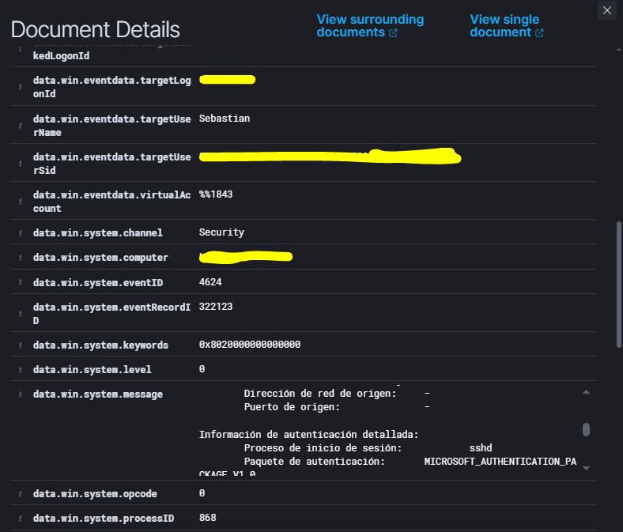
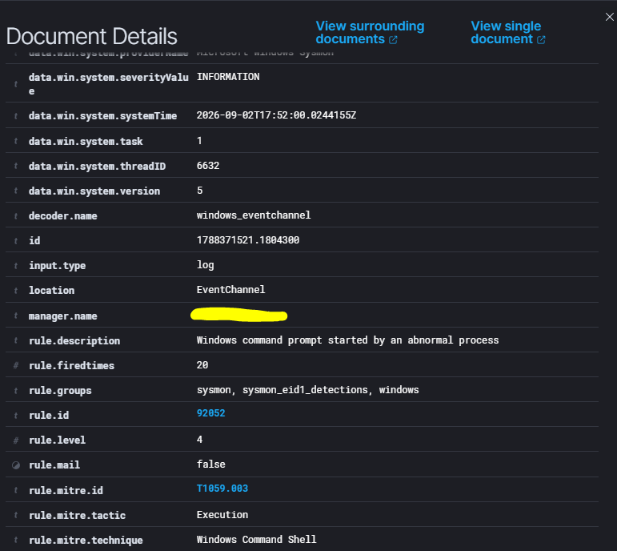
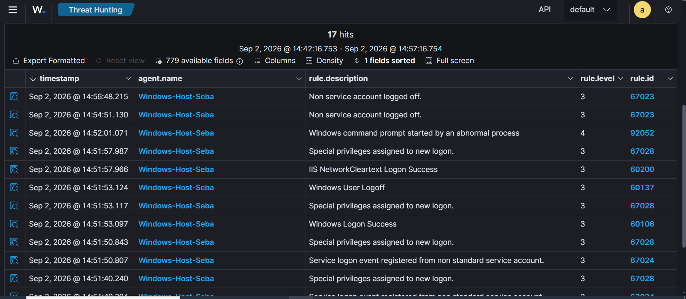

# LAB 10 - Simulated Lateral Movement Evidence

## Objective

Simulate controlled remote access from Kali Linux to a Windows endpoint and investigate the resulting authentication and process execution evidence with Wazuh.

The lab focuses on identifying indicators associated with lateral movement without using malware or exploiting vulnerabilities.

---

## Lab Architecture

Kali Linux → SSH → Windows Endpoint → Windows Security / Sysmon → Wazuh → SOC Investigation

---

## Scenario

A legitimate SSH connection was initiated from Kali Linux to the Windows endpoint using OpenSSH Server.

After authentication, controlled commands were executed remotely.

The goal was to generate evidence that could be analyzed from a SOC perspective.

---

## Remote Access

The SSH session successfully authenticated against the Windows endpoint.

The Windows Security log generated:

* Event ID `4624`
* Logon Type `3`
* Logon process: `sshd`
* Process: `C:\Windows\System32\OpenSSH\sshd.exe`

Wazuh detected the event with:

* Rule ID: `60106`
* Level: `3`
* Description: `Windows Logon Success`

MITRE ATT&CK:

* `T1078 - Valid Accounts`

---

## Remote Command Execution

After the SSH session was established, Windows created a command shell.

Sysmon recorded:

* Event ID `1`
* Process: `cmd.exe`
* Parent process: `conhost.exe`
* User context: remote authenticated user
* Integrity level: `High`

Wazuh detected:

* Rule ID: `92052`
* Level: `4`
* Description: `Windows command prompt started by an abnormal process`

MITRE ATT&CK:

* `T1059.003 - Windows Command Shell`
* Tactic: `Execution`

---

## Threat Hunting Timeline

Wazuh Threat Hunting showed several events generated around the SSH session.

Observed activity included:

* Successful network logon
* Special privileges assigned to the session
* Command shell execution
* Logoff events
* OpenSSH-related authentication activity

This allowed the activity to be reconstructed as a timeline rather than analyzing a single event in isolation.

---

## Detection Flow

The main investigation flow was:

`Kali → SSH → Windows Event 4624 → sshd.exe → cmd.exe → Wazuh`

This demonstrates how remote access between hosts can generate multiple pieces of evidence that can be correlated during a SOC investigation.

---

## SOC Investigation Notes

Lateral movement is not defined by a specific command or operating system.

The relevant behavior is:

`Access from one host → authentication on another host → execution on the remote system`

In this lab, the SSH connection represents the controlled remote access stage.

The commands executed after authentication demonstrate that activity was successfully performed on the destination endpoint.

Important investigation fields included:

* User
* Logon type
* Authentication process
* Process image
* Parent process
* Timestamp
* Wazuh rule
* MITRE ATT&CK mapping

---

## MITRE ATT&CK

Two techniques were observed during the investigation:

### T1078 - Valid Accounts

Associated with the successful remote authentication using a legitimate account.

### T1059.003 - Windows Command Shell

Associated with the creation of `cmd.exe` during the remote session.

The presence of these techniques does not automatically indicate malicious activity.

Context is required to determine whether remote access is legitimate or suspicious.

---

## Security and Sanitization

The lab used controlled systems and legitimate credentials.

Before publishing evidence, sensitive information was removed or masked, including:

* Real username where necessary
* Windows hostname
* Windows SID
* Manager hostname
* Logon identifiers
* GUIDs
* Unnecessary hashes

No malware was used and no external systems were targeted.

---

## Lessons Learned

* Lateral movement can occur across Windows, Linux and mixed environments.
* SSH can be used as a legitimate remote administration method.
* Windows Event ID `4624` can provide evidence of remote authentication.
* Logon Type `3` represents a network logon.
* OpenSSH authentication can generate Windows Security telemetry.
* Sysmon provides process creation visibility after remote access.
* Wazuh can detect unusual command shell execution.
* Multiple events should be correlated to reconstruct remote activity.
* Legitimate tools and valid credentials can still appear in suspicious activity.
* SOC investigations depend heavily on context.

---

## Conclusion

LAB 10 demonstrated how controlled remote access can generate evidence associated with lateral movement.

The investigation correlated authentication and process execution telemetry from Windows and Wazuh.

Final flow:

`Remote Access → Authentication → Process Execution → Event Correlation → SOC Investigation`

The main takeaway is that **lateral movement investigations rely on correlating multiple events rather than identifying a single alert**.
